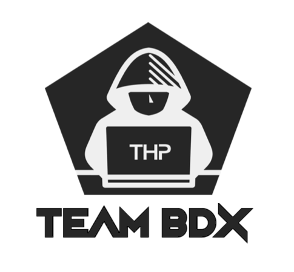

# Week n°X on Day n°X - THP by Team BDX - XXXXX

## Projet du jour :

Le projet du jour consisiste

## Pré-requis et installation :

1 - Veuillez svp vous relever de votre PLS.

2 - Veuillez cloner ce repo sur votre machine avec la commande suivante (le dossier créé s'appelera "WXDX_TeamBDX_XXXXXX") :

```
  $ git clone
```

3 - Se rendre dans le dossier souhaité, et effectuer ces XX commandes suivantes pour initialiser le fonctionnement :

```
  $ bundle install &&
```


## Fonctionnement des exercices :

### Exercice

Cet exercice

```
  $
```

*PS : .*

## Conditions de test des exercices pour les corrections

**Pour faciliter la correction des exercices précédents voici les éléments à tester dans la console rails, si vous le souhaitez. Le but est de créer des instances de classes, et des liaisons entre celles-ci pour observer le bon fonctionnement des programmes. Les commandes peuvent être :**

**NOTA : $ = terminal || > = console rails**

### Exercice

```
  >

  $
```

## Contributeurs

@bab - Baptiste ROGEON

@massimo - Maxime FLEURY

<p align="center">
  
</p>

## Pour aller plus loin

### Au début, t'es comme ca :


### A 18h, tu te dis ca :


### A 23h52 :

